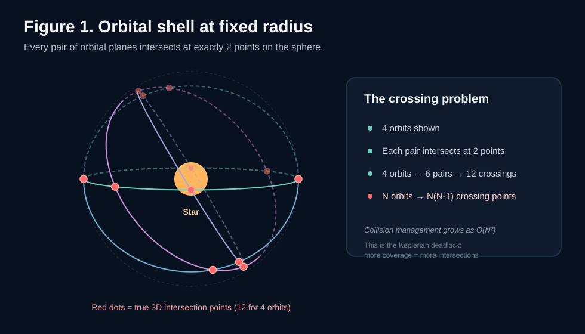
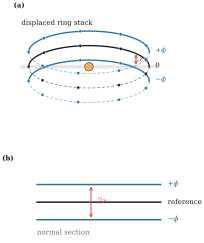
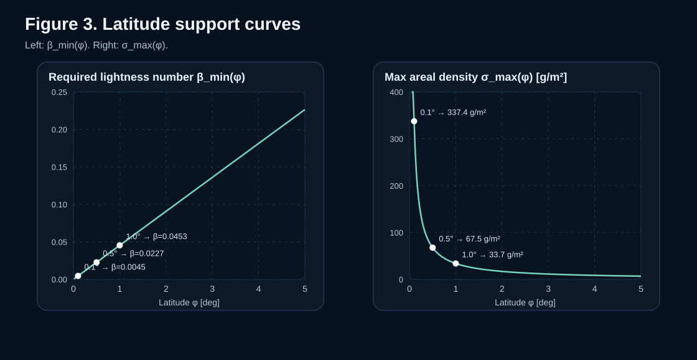
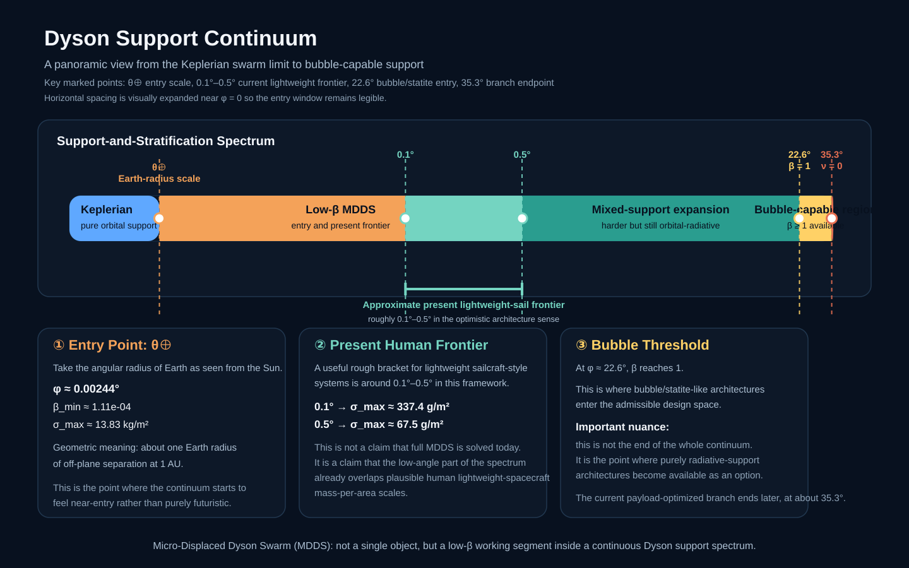

# Escaping the Orbital Deadlock: Toward a Continuous Spectrum of Dyson Architectures

When people hear "Dyson sphere," many still imagine a gigantic solid shell enclosing an entire star. But the structures that are actually worth discussing have never been a single object. They are a family of compromises.

At one extreme is the **Dyson Shell**: spectacular and complete, but almost immediately destroyed by basic problems of structural mechanics and stability.

At the simplest end is the **Dyson Ring**: a single orbital belt around the star. It captures only a small fraction of stellar output, but its geometry is clean and its organization is straightforward. In some sense it is the most geometrically "honest" option in the whole family.

At the other extreme is the **Dyson Bubble**, supported entirely by stellar radiation pressure. Its geometry is the most flexible, and it naturally avoids orbital crossings, but its material requirements are so severe that the system is pushed toward the limit of ultra-low areal density and ultra-low payload.

So most discussions naturally settle on the apparently realistic middle option: the **Dyson Swarm**. You can think of it as a great many Dyson Rings layered together. No rigid shell, no global structural integrity requirement, just a large population of independent collectors orbiting the star and expanding over time.

But anyone who has spent time with the topic knows that **"Dyson Swarm becomes an orbital traffic nightmare" is not a new observation**. In both the academic literature and hard-SF discussions, this is almost a standard pain point: once the system becomes dense and large, orbital intersections, collision avoidance, and phase management quickly become the central difficulty.

What I want to do here is not to repackage that known problem as some dramatic discovery. I want to take it apart and look at why it is so geometrically persistent, why it is not only a collision-management problem but also a growth problem, and then explain why precisely this lack of elegance forced me to look for a cleaner geometric viewpoint.

And here "elegance" is not an aesthetic preference. **The more a structure gets its order directly from geometry, rather than from endless coordination and traffic control, the more elegant it is.**

## The real difficulty of a Dyson Swarm is not just energy, but topology and growth

If a Dyson Swarm is only a sparse set of collectors on widely separated orbits, then of course there is no great problem.

But once you start imagining it as genuine large-scale infrastructure, the situation changes. You are no longer placing a few probes. You are organizing a massive, continuously operating, dense orbital system.

And ordinary Keplerian motion contains one brutally simple geometric fact:

> As long as the motion is purely Keplerian, every orbital plane must pass through the central body.

The consequences are serious.

If you want to place many differently inclined orbits at roughly the same stellar radius, those orbits are not independent. They must intersect at their nodes. Once the number of orbits grows, those nodes stop being two abstract textbook points and become the traffic hubs, conflict sources, and complexity amplifiers of the entire system.

Put more bluntly:

**A Dyson Swarm may look like it is adding freedom, but in practice it can force all of that freedom back into a small set of unavoidable crossing points.**

Many visions of Dyson Swarms quietly assume that "sufficient quantity" is itself the solution. But in orbital topology, adding more objects often does not solve the problem. It scales the problem until it becomes unmanageable. You are not just increasing collecting area; you are increasing the burden of the entire nodal network.

## Dyson Ring: honest, but limited

Seen from this angle, the **Dyson Ring** acquires a certain strange honesty.

Of course it is limited. It covers only a small fraction of stellar radiation and cannot pretend to be a complete enclosure. But at least it does not pretend to have solved the organization problem. It is one clear, symmetric structure.

And if you mentally unpack a "same-altitude large Dyson Swarm," it is in some sense not fundamentally different from many Dyson Rings broken apart and scattered. More abstractly, Dyson Ring and Dyson Swarm belong to the same topological class: both are collections of orbital corridors that have to be organized at nearly the same stellar radius, and both generate a network of orbital intersections. A single Ring is just one corridor in that network; a Swarm is many corridors laid over one another. More orbits mean more nodes. The system starts to look less like a free spatial cloud and more like a transportation network forced to organize passage through a small number of bottlenecks.

Dyson Ring is elegant, but too limited. Dyson Swarm looks more practical, but once I looked closely at its orbital organization problem, it no longer felt geometrically clean.

## The common fixes never really break the deadlock

One common response is to borrow ideas from Walker constellations and related modern constellation design: spread out the crossings in time and space so the nodes do not pile up at the same locations.

That helps, and it is a very natural engineering instinct. But it is better understood as redistributing complexity rather than eliminating complexity.

You can turn one conflict point into many conflict points. You can turn one congested intersection into many smaller ones. But as long as the system is still built out of a large number of intersecting Keplerian tracks, the burdens of traffic management, phasing, collision avoidance, and long-term stability do not really disappear. Once the system keeps growing, complexity still blows up. Walker-style architectures are very good at redistributing encounters in time; they do not geometrically remove the underlying crossing topology.

And there is a deeper problem: **this style of solution is not very friendly to progressive build-out**. Walker constellations are "elegant" partly because, for a fixed number of planes, fixed number of satellites, and fixed phase relation, there is an overall optimized arrangement. They are naturally biased toward a static solution for a fixed parameter set. But once you add another plane or another batch of nodes, the whole "optimal arrangement" may need to be reorganized.

For a paper design that is fine. For a Dyson-scale architecture already under construction, it becomes a deeply unrealistic requirement. We cannot expect to tear up and re-phase everything that has already been launched and deployed every time we add another layer. A genuinely sustainable large architecture has to allow continued growth without requiring wholesale global reconfiguration.

Another response is to separate the structure into radial layers. If same-radius tracks create unavoidable crossings, then distribute them at different distances from the star.

That is also reasonable, but it quickly introduces new problems: inner layers shading outer ones, radiative coupling between layers, and a more difficult hierarchy of organization and maintenance.

And, by the standard I laid out earlier, it is not especially elegant. The order of the structure still does not come directly from geometry. It has to be maintained by continued layered management.

## The turning point: can we keep the orbit, without remaining trapped by the orbital plane?

The turning point was actually simple.

I began to suspect that we had been forcing the problem into an unnecessarily rigid binary:

- either a purely Keplerian Dyson Swarm
- or a fully radiation-supported Dyson Bubble

But what if the space between them is not a discontinuity, but a continuous interval?

What happens if a node is still supported mostly by orbital motion and borrows only a small amount of radiation pressure for a modest out-of-plane component?

At that point, the question changes shape. We are no longer asking:

> Can we levitate completely?

Instead we are asking:

> Can we lift the orbital plane just a little?

## Borrow just a little radiation pressure, and a 2D problem opens into 3D

Solar-sail theory already contains a mature family of trajectories known as **Displaced Non-Keplerian Orbits**.

The intuition is not complicated. A body is still moving around the star in a circular path, but it is no longer trapped in the traditional orbital plane. With the right radiation-pressure component, it can remain above or below the stellar equatorial plane on a circular orbit with a persistent out-of-plane displacement.

The key point is that this does not discard "orbit." It makes the smallest possible but decisive modification to orbit.

The problem with an ordinary Dyson Swarm is fundamentally a two-dimensional topological problem: every orbital plane passes through the star, and all complexity gets compressed back into crossing points. Worse, once the system tries to grow, it has to keep adding traffic management on top of that crossing network.

But once we allow even a small amount of out-of-plane support, that two-dimensional problem opens into a three-dimensional stratification problem.

Instead of imagining only a pile of mutually intersecting trajectories, we can begin to imagine layer after layer of separated latitude bands.

At that moment, the entire character of the structure changes. We still keep orbital motion. We still do not have to enter the extreme material regime of the Dyson Bubble. But we are no longer trapped by the Keplerian deadlock in which every track must intersect every other through the same central geometry. The question begins to shift from "How do we manage intersections?" to "How do we organize the support geometry?"

## Very small angles are enough to create very large stratification

In the most compact form, the ideal-specular-sail framework gives the minimum radiation-pressure parameter required to maintain an out-of-plane latitude:

$$
\beta_{\min}(\phi)=\frac{3\sqrt{3}}{2}\sin\phi
$$

The meaning is straightforward. The farther you leave the equatorial plane, the more radiative support you have to pay for. Higher latitude means tighter requirements.

Equivalently, the same result can be rewritten as a maximum supportable system areal density:

$$
\sigma_{\max}(\phi)=\frac{2\sigma^*}{3\sqrt{3}\sin\phi}
$$

So the question can be compressed into a very engineering-style sentence:

> If your total system areal density falls below this curve, then the architecture is supportable at that latitude.

The interesting part is not the formula itself, but the numbers it gives.

At 1 AU, if we evaluate a very small angle, $\phi = 1^\circ$:

- required $\beta_{\min} \approx 0.0453$
- maximum total system areal density $\approx 33.8\ \mathrm{g/m^2}$
- resulting out-of-plane separation $\approx 2.6 \times 10^6\ \mathrm{km}$

That is striking.

We do not need to approach the fully radiation-supported limit of $\beta \ge 1$. A very low $\beta$ is already enough to buy enormous spatial separation.

The angle can be much smaller still. For $\phi = 0.1^\circ$:

- $\beta_{\min} \approx 0.00453$
- $\sigma_{\max} \approx 337.4\ \mathrm{g/m^2}$

That is already a few tenths of a kilogram per square meter of allowable total system mass.

And if we choose an even more intuitive characteristic angle, the angular radius of Earth as seen from the Sun, $\theta_\oplus \approx 0.00244^\circ$:

- $\beta_{\min}(\theta_\oplus) \approx 1.11\times 10^{-4}$
- $\sigma_{\max}(\theta_\oplus) \approx 13.83\ \mathrm{kg/m^2}$

Nearly 14 kilograms per square meter. That is already a number compatible with real payload-bearing systems.

The important point is not that "the problem is solved." It is that the problem has been moved out of the regime where only fantasy materials matter, and back into an engineering spectrum with a genuine entry window.

## A concrete example: lifting a small car into the "north-pole layer"

If we use the ecliptic as the "equator" of the architecture, then $z=\pm R_\oplus$ can be treated as a very small but very concrete "north-pole / south-pole" window: one Earth radius above and below the ecliptic.

At this entry-level scale, the maximum allowable system areal density is about

$$
\sigma_{\max} \approx 13.83\ \mathrm{kg/m^2}
$$

That threshold is already extremely permissive. It almost immediately translates into another question:

> If I wanted to place a small car in that "north-pole layer," how large a sail would I need?

Since the constraint is on **total system areal density**, the minimum area is

$$
A_{\min}=\frac{M_{\mathrm{sys}}}{\sigma_{\max}}
$$

Take a small passenger car with mass roughly $1500\ \mathrm{kg}$:

$$
A_{\min}\approx \frac{1500}{13.83}\approx 108.5\ \mathrm{m^2}
$$

That is roughly a square sail about $10\ \mathrm{m}$ on a side, basically a double-garage-scale deployment.

The reason this feels counterintuitive is that the sail is not "holding up a car against the full gravity of the Sun." The car is still orbiting the Sun in the usual way. Orbital motion is already doing almost all of the dynamical work. The sail is only adding the small out-of-plane support needed to lift the geometry away from the ecliptic.

That is the core of the framework:

**not using huge radiation pressure to replace orbit, but using very small radiation pressure to rewrite the geometry of orbit.**

## From the "south-pole layer" to the "north-pole layer," how many parallel lanes fit?

Now expand that entry-level window from $z=-R_\oplus$ to $z=+R_\oplus$. The total vertical thickness is

$$
2R_\oplus \approx 12742\ \mathrm{km}
$$

So the next natural question is:

> Inside this channel from the "south-pole layer" to the "north-pole layer," how many parallel rings can actually fit?

The most important benefit here is not only that the rings no longer share high-speed nodal crossings. With a small amount of radius correction between layers, they can also be tuned to nearly the same angular speed. These bands are not like ordinary nested Keplerian orbits, where inner rings continuously overtake outer rings and outer rings are continuously overtaken by inner rings. They are much closer to a set of co-rotating parallel layers. The main spacing constraint becomes control precision and safety margin, not the avoidance of high-speed crossing traffic.

So the following numbers should be interpreted as **order-of-magnitude geometric capacity estimates**, not as a final engineering ceiling with control closure already solved.

If the layer spacing is $\Delta z$, then the approximate number of layers is

$$
N \approx \frac{2R_\oplus}{\Delta z}+1
$$

A few intuitive numbers:

- conservative spacing $\Delta z = 100\ \mathrm{km}$ → about $128$ layers
- moderately aggressive spacing $\Delta z = 10\ \mathrm{km}$ → about $1275$ layers
- aggressive spacing $\Delta z = 2\ \mathrm{km}$ → about $6372$ layers

The real meaning of this result is not that "we can instantly build six thousand Dyson rings." It is this:

**Even inside a north-south window only one Earth radius thick on each side, the near-line-like collecting surface of a traditional single Dyson Ring can already be opened into a three-dimensional structure tens of thousands of kilometers thick, with room for hundreds to thousands of independent lanes.**

That is the geometric dividend of going from two dimensions to three.

## Not a new label, but a continuous spectrum

The most important conclusion may not be "I found a new Dyson structure." It may be this:

**We may have been using an overly discrete language for Dyson architectures all along.**

Shell, Swarm, and Bubble are useful words, but they encourage the impression that these are sharply separated categories.

Once radiative support is included, a more natural picture is:

- purely Keplerian planar swarm
- low-$\beta$, slightly displaced stratified swarm
- more strongly radiatively assisted support structures
- fully radiatively supported Bubble / Statite limit

These are not necessarily the same engineering object, but they can be understood as lying on a single continuous support spectrum.

From this perspective, the interesting thing about MDDS (Micro-Displaced Dyson Swarm) is that it makes one previously under-emphasized low-$\beta$ working segment of that spectrum explicit. It is not a purely Keplerian Swarm. It is not a Bubble either, with its nearly brutal material demands. It occupies an intermediate zone between the two that had not really been named and foregrounded in Dyson architecture language.

There are two threshold points on that continuum that are worth marking:

- **the $\beta = 1$ threshold** (around $\phi \approx 22.6^\circ$): at this point purely radiatively supported bubble/statite architectures become available in principle, but along the present payload-friendly branch orbital support is still present ($\nu \approx 0.64$)
- **the $\nu = 0$ threshold** (around $\phi \approx 35.3^\circ$, with $\beta = 1.5$): the internal endpoint of the current low-$\beta$ branch, where orbital support disappears completely

And the real value of this continuum is not just classificatory elegance. It changes the language of the problem. We are used to thinking about Dyson Swarms as an intersection-management problem: how to coordinate traffic, phasing, and collision avoidance among unavoidable crossing nodes. MDDS rewrites that as a support-geometry problem: how to use stratification, synchronization, and low-$\beta$ support to organize an expandable three-dimensional structure.

## Back to elegance

Back to the definition from the beginning: the more the order of a structure comes from geometry itself, rather than from continued coordination and regulation, the more elegant it is.

The problem with an ordinary Dyson Swarm is that it looks free, but much of that freedom is deceptive. The conflict is merely hidden inside the nodes. The order of the system has to be maintained by continual traffic management, and as the system grows, that management burden becomes part of the structure itself.

By contrast, this low-$\beta$, micro-displaced stratified approach has a much cleaner feel:

- not abandoning orbital motion completely to buy freedom
- not preserving the same topology by fragmenting it into ever more complicated traffic patterns
- but directly rewriting the geometry through a very small, but very consequential, physical correction

Once the geometry is rewritten, order can emerge from the structure itself rather than from endless coordination. That makes this direction worth studying as engineering, and also more elegant as a concept.

## A more plausible growth path

If this perspective is right, then a Dyson architecture may be better understood not as a single terminal object to be completed all at once, but as a structure that can grow in stages: start in the low-latitude, small-angle region closest to the Keplerian limit, and then expand toward higher latitudes as materials, deployment, and control improve.

More concretely, that path can be thought of in at least three stages:

1. **Start near the ecliptic.**  
   This is where the required $\beta$ is lowest and the allowable system areal density is highest. It is the easiest part of the continuum to enter, and it does not force us to challenge the harshest material limits on day one.

2. **Make every early node immediately useful.**  
   Those first nodes can be tuned to Earth-synchronous or near-Earth-synchronous heliocentric periods, turning them into long-lived collector, relay, or infrastructure units rather than temporary placeholders waiting for some distant final shell.

3. **Expand outward in latitude over time.**  
   As system areal density improves and deployment and control become more capable, the stratified band can be pushed progressively farther from the ecliptic. The key is that growth does not require global reconfiguration each time. Existing layers remain useful while new layers thicken the structure.

That, to me, is one of the most important features of the idea: **every intermediate state is useful.**  
The early low-latitude nodes are not disposable prototypes. They are the first layer of the eventual stellar-energy infrastructure.

From that perspective, I think a slightly bolder statement is also justified:

**we do not need to wait for some distant future "Dyson age" before beginning.**  
If we only ask for the most entry-level low-latitude regime, on the scale of roughly one Earth radius of out-of-plane stratification, then the pure areal-density threshold already falls within the broad order of magnitude of present lightweight spacecraft systems. That does not mean we can build a Dyson Swarm today. But it does mean that **today's technology may already be sufficient to take the first step onto this continuum.**

In that sense, a Dyson structure stops looking like a static noun and starts looking like evolving infrastructure: an expandable architecture rather than a megastructure defined only by its final state.

So instead of treating Shell, Swarm, and Bubble as disconnected labels, it may be better to understand them as regions of a single **Dyson support continuum**.
