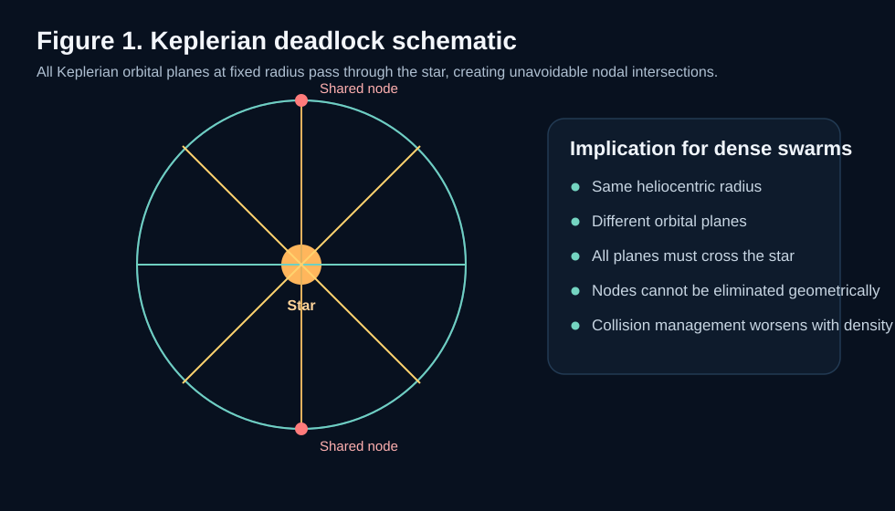
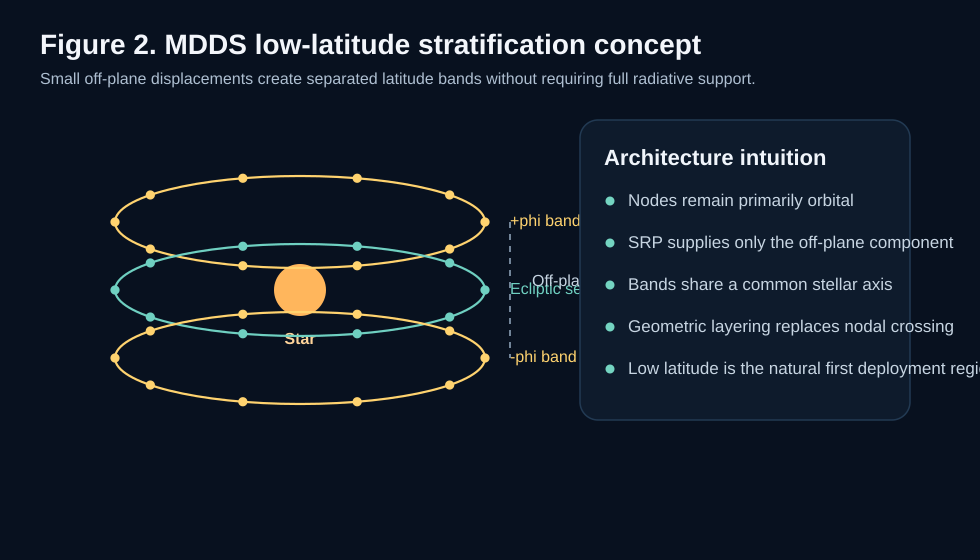
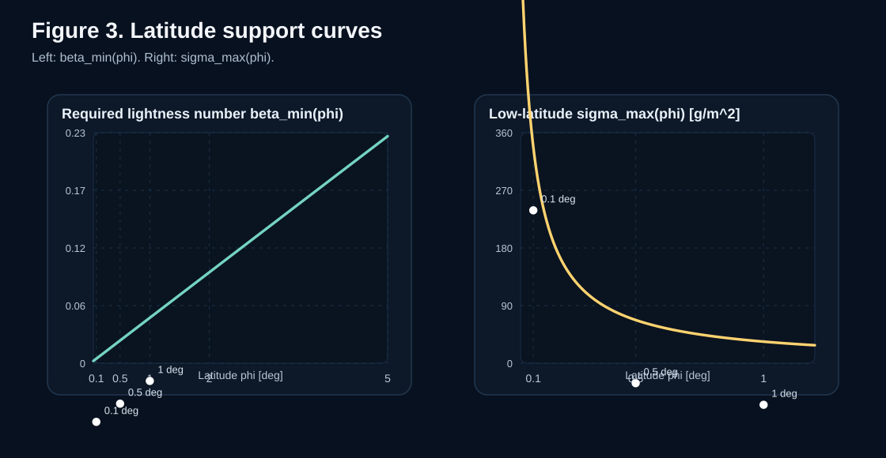

# 逃离轨道死结：出于对“美”的追求，我重新构思了戴森群架构

## 副标题候选

- 为什么看起来最现实的 Dyson Swarm，反而可能是最难管理的那一种
- 从戴森环到戴森泡：一种连续的戴森结构谱
- 只借一点点光压，我们也许可以重写戴森群的几何

---

## Draft Note

这是一篇面向博客/长文的中文草稿，不是论文摘要的简化搬运。

它的叙事顺序是：

**困惑 -> 直觉 -> 失败方案 -> 转折 -> 新框架**

而不是论文的：

**结论 -> 推导 -> 边界 -> 例证**

---

## 正文

最近看特斯拉、SpaceX 这类公司对产能、算力和大规模部署的执念时，我脑子里反复冒出一个画面：如果把这种扩张逻辑一路往前推，它最终触碰到的，其实就是某种“戴森球问题”。

这让我忍不住顺着这个思路，重新去翻看了一下目前主流的戴森工程架构。

提起“戴森球”，很多人脑海里浮现出的，仍然是那个把恒星整个包起来的巨大壳体。可只要稍微认真一点去看这个问题，你就会发现，真正可以讨论的从来不是一个单一结构，而是一组彼此妥协的方案。

最极端的是 **Dyson Shell**。它壮观、完整，也最符合科幻直觉，但几乎立刻会撞上结构力学和稳定性上的根本问题。

另一端是 **Dyson Bubble**，也就是完全依靠恒星辐射压力来支撑的方案。它的几何最自由，不需要传统轨道，也因此天然避开了大量轨道交错问题。但它对材料的要求过于严苛，几乎把系统直接推到了“面密度极低、载荷极少”的极限上。

于是，很多讨论会自然落到看起来最现实的中间方案上：**Dyson Swarm**。不造壳，不要求整体刚性，只是把大量独立节点放到恒星周围的轨道上，逐步扩张，逐步部署。

如果你关注过相关的太空工程讨论就会知道，**“Dyson Swarm 是一个极其复杂的轨道交通地狱”其实并不是什么新发现。** 在学界和硬科幻圈里，这几乎已经是公开的痛点：只要系统开始走向高密度、长寿命和大规模部署，轨道相交、避碰组织、相位管理和长期维护就会立刻变成核心难题。

所以我今天真正想聊的，并不是把这个已知问题重新包装成某种“惊天发现”。我更想做的，是先把这个痛点拆开，看看它为什么从几何上如此顽固；然后再解释，为什么正是这种不够优雅的状态，逼着我去寻找另一种更干净的几何视角。

## 戴森群真正的难点，也许不是能量，而是几何

这不是一个新发现，但它值得被重新拆开。因为后面那条低 $\beta$、微位移、可分层的连续谱路径，正是从这个已知痛点的几何结构里长出来的。

如果一个戴森群只是很稀疏地分布在各个不同轨道上，那当然没什么问题。

可一旦你把它想成一个真正的大规模基础设施，问题就变了。你不再是在摆几个探测器，而是在组织一个巨大的、持续运行的、密集的轨道系统。

而传统开普勒轨道有一个非常冷酷的几何事实：

> 只要还是普通开普勒轨道，轨道平面就必须经过中心天体。

这句话的后果非常严重。

它意味着，如果你想在差不多相同的恒星距离上布置大量不同倾角的轨道，那么这些轨道并不是彼此独立的，它们必然会在节点处相交。轨道一多，这些节点就不再只是几何课本上的两个点，而会变成整个系统的交通枢纽、冲突源和复杂度放大器。

如果把问题说得更直白一点：

**Dyson Swarm 看起来像是在增加自由度，实际上却可能是在把所有自由度都重新压回几个不可回避的交叉点里。**

这也是我后来越来越在意的一点。很多关于 Dyson Swarm 的想象默认了“数量足够多”这件事本身就是解法，但在轨道拓扑上，数量变多往往不是解法，反而是把问题推到不可管理的规模。

## 戴森环为什么“美”，又为什么不够

从这个角度再回看 **Dyson Ring**，它反而会显得有一种奇怪的诚实。

它当然很受限。它只能覆盖恒星辐射的一小部分，也谈不上什么完整包覆。但至少它没有假装自己解决了组织问题。它就是一个单一、清晰、对称的结构。

而如果把一个“同高度的大规模 Dyson Swarm”硬拆开来看，它在某种意义上和很多个被打散的戴森环并没有本质区别。更抽象一点说，在这个问题上，**Dyson Ring 和 Dyson Swarm 本质上是同构的**：它们都是由一组需要在同一恒星距离附近组织通过关系的轨道通道组成。单个 Ring 只是这组结构中的一条轨道；Swarm 则是很多条轨道的叠加。

这也意味着，每增加一条轨道，你增加的并不只是收集面积，同时也在增加整个系统的相交节点网络。轨道越多，节点越多；节点越多，系统就越像一个被迫在少数瓶颈位置组织通行的大规模交通系统。于是，整个架构的总容量，最终就不再只取决于“理论上能铺多少轨道”，而会越来越受限于这些节点能够承受多大的安全通过量。

这也是我开始觉得不满足的地方。

Dyson Ring 很美，但太有限。

Dyson Swarm 看起来更现实，但当我认真去看它的轨道组织问题时，它又显得不够干净。

## 常见解法，其实都没有真正解除这个死结

一种常见思路，是借鉴 Walker constellation 这类现代星座设计的想法，把相交关系拆散，让节点不要集中在同一个位置。

这当然有用，而且在工程上非常自然。问题在于，它更像是在重新分配复杂度，而不是消灭复杂度。

你可以把一个冲突点拆成很多个冲突点，把一个拥堵十字路口拆成很多个分散路口，但只要系统依然建立在大量相交轨道之上，交通管理、相位组织、避碰策略和长期稳定性这些负担就不会真正消失。系统一旦继续放大，复杂度仍然会迅速膨胀。

而且这里还有一个我觉得更致命的问题：**这种思路对渐进建设并不友好。** Walker constellation 一类方案之所以“好看”，往往是因为它在给定轨道数、给定相位关系下存在某种整体最优排布。但这恰恰意味着，每当你往系统里再增加一条轨道，甚至再增加一批节点，整个“最优配置”都可能需要重新排布。

对于一个纸面设计，这当然没问题；你完全可以重新算一遍参数表。但对一个已经开始建设的戴森架构来说，这就变成了非常不现实的要求。我们不可能每扩一层、每加一批节点，就把已经发射、已经部署、已经运行的那些轨道全都拆掉，再重新按新的全局最优去铺一遍。一个真正可持续的大尺度架构，必须允许你在保留既有结构的前提下继续增长，而不是每长大一点，就要求整个系统回炉重排。

另一条思路，是把结构做成不同层级。既然同高度上容易相交，那就把它们放到不同高度去。

这条路也合理，但它很快会引入新的问题：

- 内层对外层的遮挡
- 热辐射耦合
- 不同层级的组织与维护复杂度

更重要的是，从几何上说，它并不优雅。

这里的“优雅”不是审美修辞，而是一个很实际的工程直觉：**一个真正好的大尺度结构，最好不是靠不断追加补丁来维持，而是从几何上就尽量减少冲突、减少耦合、减少必须被持续管理的东西。**

也正是这种对“美”的追求，让我继续往下想。

## 我真正开始在意的是：能不能保留轨道，却不再被轨道平面绑死

那个转折点其实很简单。

我开始怀疑，我们是不是一直都把问题放在一个过于僵硬的二分法里：

- 要么是纯开普勒的 Dyson Swarm
- 要么是完全依赖光压支撑的 Dyson Bubble

可如果这两者之间，并不是一道断裂，而是一段连续区间呢？

如果一个节点仍然主要依靠轨道运动来完成支撑，只借用一小部分辐射压力来做一点点离面支撑，会发生什么？

这时，问题的形状就变了。

我们不再是在问“能不能完全悬浮”，而是在问：

> 能不能只把轨道平面轻轻抬起来一点点？

这就是我后来重新回到太阳帆动力学时最感兴趣的地方。

## 只借一点点光压，二维问题就会变成三维问题

在太阳帆和位移轨道的理论里，存在一类很成熟的对象，叫做 **Displaced Non-Keplerian Orbit**，也就是位移非开普勒轨道。

它的直觉并不复杂。

一个物体仍然在围绕恒星做圆周运动，但它不再被限制在传统的轨道平面里。通过适当的光压分量，它可以在恒星赤道面之上或之下，维持一个带有离面位移的圆轨道。

这件事最吸引我的地方在于，它不是把“轨道”扔掉，而是对“轨道”做了最小但关键的修改。

普通 Dyson Swarm 的问题，本质上是一个二维轨道拓扑问题。所有轨道平面都穿过恒星，所有复杂度都被压回交点。

但只要允许一点点离面支撑，这个二维问题立刻会被打开成一个三维分层问题。

于是你不再只能想象一堆互相交叉的轨道，而是可以开始想象一层又一层彼此分离的纬度带。

这时候，结构的气质完全变了。

你依然保留了轨道运动。

你依然不需要进入 Dyson Bubble 那种极端材料区间。

但你已经不再被“所有轨道必须相交”这个开普勒死结绑死。

## 关键不在于悬浮得多高，而在于哪怕很小的角度，也足以带来巨大的分层

如果把这个框架写成一个最紧凑的判据，那么对于理想镜面帆，维持某个离面纬度所需的最低光压参数可以写成：

$$
\beta_{\min}(\phi)=\frac{3\sqrt{3}}{2}\sin\phi
$$

这背后的意思并不神秘。

它只是告诉我们：你想离开赤道面多少，就要付出相应的辐射支撑代价；角度越高，要求越严。

更直观一点，它也可以改写成系统面密度上限：

$$
\sigma_{\max}(\phi)=\frac{2\sigma^*}{3\sqrt{3}\sin\phi}
$$

也就是说，问题最后可以被压缩成一句非常工程化的话：

> 如果你的系统总面密度低于这条曲线，它就在这个纬度上是可支撑的。

而真正让我感到这个框架“有东西”的，不是公式本身，而是代进去之后得到的数字。

在 1 AU 处：

- 当 $\phi = 1^\circ$ 时，所需 $\beta_{\min} \approx 0.0453$
- 对应的最大系统面密度约为 $33.8\ \mathrm{g/m^2}$
- 但它带来的离面分层已经达到约 $2.6 \times 10^6\ \mathrm{km}$

这很惊人。

因为这说明我们并不需要接近 $\beta \ge 1$ 的完全辐射支撑极限，只要非常低的 $\beta$，就已经可以换来极大的空间分离。

如果再往入口级看：

- 当 $\phi = 0.1^\circ$ 时，$\beta_{\min} \approx 0.00453$
- 对应 $\sigma_{\max} \approx 337.4\ \mathrm{g/m^2}$

甚至如果取一个更直观的特征角，也就是从太阳看地球的角半径 $\theta_\oplus \approx 0.00244^\circ$，那么：

- $\beta_{\min}(\theta_\oplus) \approx 1.11\times 10^{-4}$
- $\sigma_{\max}(\theta_\oplus) \approx 13.83\ \mathrm{kg/m^2}$

这件事的重要性，不在于“问题已经解决了”，而在于它把整个问题从“只有遥远未来的幻想材料才能碰”拉回到了一个真正存在入口区间的工程光谱上。

## 一个更具象的入口级例子：把一辆小汽车抬到“北极层”

这里我很想把这个角度再翻译成一个更有画面感的问题。

如果把黄道面借来当作这套结构的“赤道”，那么 $z=+R_\oplus$ 和 $z=-R_\oplus$ 就可以被看作一个很小但很具体的“北极/南极”窗口。这里的意思不是地球自转轴上的北极和南极，而是相对于黄道面，上下各偏离一个地球半径的两条对称分层。

在这个入口级尺度上，允许的系统面密度上限约为：

$$
\sigma_{\max} \approx 13.83\ \mathrm{kg/m^2}
$$

这个门槛已经非常宽松了。

它几乎可以立刻被翻译成另一个问题：

> 如果我想把一辆小汽车送到这个“北极层”上，需要多大的太阳帆？

由于这里约束的是**总系统面密度**，最低面积满足：

$$
A_{\min}=\frac{M_{\mathrm{sys}}}{\sigma_{\max}}
$$

如果先把问题理想化，只拿一辆质量约 $1500\ \mathrm{kg}$ 的小轿车做载荷，暂时忽略帆膜、支撑和控制系统自身的附加质量，那么：

$$
A_{\min}\approx \frac{1500}{13.83}\approx 108.5\ \mathrm{m^2}
$$

这大约相当于一张边长约 $10.4\ \mathrm{m}$ 的正方形帆。

换句话说，如果只从这个入口级支撑门槛本身来看，想把“一辆车”抬到距离黄道面一个地球半径高的位置，所需的理想反射面积甚至只是一个双车库量级的展开面。

即便把问题稍微现实一点，给帆膜、支撑桁架、姿态控制和接口机构预留更多余量，把总系统质量放宽到 $2000\ \mathrm{kg}$，所需面积也不过：

$$
A_{\min}\approx \frac{2000}{13.83}\approx 144.6\ \mathrm{m^2}
$$

也就是边长大约 $12.0\ \mathrm{m}$ 的正方形。

这件事之所以反直觉，是因为这张帆并不是在“托举一辆车去对抗太阳的全部引力”。

这辆车本身仍然几乎是在正常地绕太阳公转。轨道运动已经承担了绝大部分动力学平衡，太阳帆只是在补上那一小部分“把它从黄道面轻轻托起来”的离面支撑。

这正是这个框架最迷人的地方：**它不是用巨大的光压去替代轨道，而是用极小的光压去改写轨道的几何。**

## 从“北极层”到“南极层”，能塞下多少条平行车道？

如果把这个入口级窗口继续展开，那么从 $z=-R_\oplus$ 到 $z=+R_\oplus$，总共就有大约：

$$
2R_\oplus \approx 12742\ \mathrm{km}
$$

的垂直厚度。

这时候，一个很自然的问题就出现了：

> 在这条从“南极层”到“北极层”的通道里，我们到底能放下多少层平行环？

这里最重要的红利，还不只是“它们不再共享高速节点交叉”。我们在论文里已经专门算过：只要对不同层级做一点点轨道半径修正，就可以把它们调到几乎相同的角速度上。换句话说，这些分层环带并不是传统嵌套轨道那种“内圈不断追外圈、外圈不断被内圈超越”的关系，而更接近一组同步转动的平行层。这样一来，各层之间基本不会积累出显著的切向相对运动，层间距的主要约束也就不再是“如何避免在共同节点上发生高速对撞”，而更多变成了结构尺寸、姿态控制误差、太阳风和光压扰动包络，以及你愿意给运营留出多大安全裕量。

所以，下面这些数字应该被理解为**几何容量的量级估算**，而不是已经完成控制闭合后的最终工程上限。

如果把层间距记为 $\Delta z$，那么可容纳层数大致满足：

$$
N \approx \frac{2R_\oplus}{\Delta z}+1
$$

举几个很直观的数字：

- 如果取一个非常保守的层间距，$\Delta z = 100\ \mathrm{km}$，那么可以放下约 $128$ 层。
- 如果取一个中等偏激进、但仍然远大于单节点结构尺度的间距，$\Delta z = 10\ \mathrm{km}$，那么可以放下约 $1275$ 层。
- 如果取一个更激进的层间距，$\Delta z = 2\ \mathrm{km}$，那么可以放下约 $6372$ 层。

这个结果的真正含义，不是“我们立刻就能建出六千层戴森环”，而是：

**哪怕只在一个地球半径这么薄的南北窗口里，传统单层戴森环那种近乎一条线的收集面，也已经可以被打开成一个厚达上万公里、可分成上百到上千条独立车道的三维结构。**

这就是从二维到三维的几何红利。

## 这不是一个新标签，而是一条连续谱

到这里我慢慢意识到，最重要的结论可能并不是“我找到了一种新的戴森结构”。

真正重要的结论更像是：

**我们可能一直都在用一种过于离散的语言来讨论戴森架构。**

Shell、Swarm、Bubble 这些词很方便，但它们也会让人误以为这是三种彼此隔开的类别。

而如果把辐射支撑考虑进去，一个更自然的图景其实是：

- 纯开普勒支撑的平面 Swarm
- 低 $\beta$、小离面的分层 Swarm
- 更高辐射参与度的支撑结构
- 完全辐射支撑的 Bubble / Statite 极限

它们未必是同一种工程对象，但它们确实可以被放到同一个连续的支撑谱里来理解。

从这个角度看，MDDS 最有意思的地方，就在于它把这条连续谱中一个此前并没有被清楚强调的低 $\beta$ 工作段显式写了出来。

它不是纯粹的 Keplerian Swarm。

也不是那种对材料近乎残酷的 Bubble。

它更像是两者之间一个此前没有被认真命名的中间地带。

## 对我来说，这件事最打动人的地方，其实还是“美”

这里的“美”，不是那种空泛的浪漫感，而是一种结构上的满足。

一个好的大尺度架构，应该尽量让秩序来自几何本身，而不是来自永无止境的协调、修补和交通管制。

普通 Dyson Swarm 的难题在于，它看起来是自由的，但那种自由很大程度上只是把冲突藏到了节点里。

而这种微位移、低 $\beta$ 的分层思路，给了我一种更干净的感觉：

- 不是靠彻底放弃轨道来换取自由
- 也不是靠把同一个拓扑问题拆得越来越碎来维持运转
- 而是通过非常小但关键的物理修正，直接改写了几何

这就是为什么我会觉得，这个方向不仅工程上值得研究，而且在概念上也更“美”。

## 一个更有希望的戴森增长路径

如果这个视角是对的，那么戴森结构也许就不该被理解为某个一次性完成的终极物体。

它更像是一条可以逐步生长的路径：

1. 从最接近开普勒极限的低纬、小角度区域开始
2. 在每一步都保持节点本身具有实际功能
3. 随着材料、控制、制造和部署能力增强，再逐渐向更高纬扩张

如果进一步采用论文里讨论过的同步约束变体，那么这些节点还可以被调到与地球保持相同公转周期。这样一来，每一个已经部署出去的节点就不只是一个短期摆设，而可以成为一个能够长期运行、长期利用的基础设施单元。

这样一来，Dyson 结构就不再只是一个静态名词，而开始更像一种演化中的基础设施。

这也是为什么我现在越来越倾向于把它理解成一条 **Dyson support continuum**，而不是几个分裂的标签。

## 结语

我并不认为这个想法已经解决了 Dyson 工程的全部问题。

它没有自动解决结构闭合、姿态控制、长期稳定性、部署成本，也没有证明大规模系统在现实中一定可行。

但它至少让我意识到一件很重要的事：

**Dyson Swarm 的核心难题，也许首先不是“怎么造更多东西”，而是“怎么让几何本身不要和你作对”。**

而一旦你愿意从这个角度重新看待问题，就会发现，Shell、Swarm、Bubble 也许从来都不是三个互不相干的答案。它们更像是一条连续的宇宙工程谱系，而我现在最感兴趣的，正是这条谱系中那个低 $\beta$、低纬度、刚刚脱离开普勒死结的起始区间。

真正的工程美学，也许不在于一开始就勾勒出一个遥不可及的终极形态，而在于找到一条哪怕用今天的物理直觉也能踏上去的渐进之路。对我来说，**Dyson support continuum** 正是在提供这样一种视角。

它告诉我们，没有必要一上来就挑战最残酷的材料极限，也没有必要继续在开普勒的二维死结里硬撑。只要从低纬度、低 $\beta$ 的舒适区开始，借用一丝很小的光压，我们就已经能够把原本拥挤、相交、不断累积交通复杂度的平面群，展开成一个在三维空间中有厚度、有层级、可同步、可渐进增长的基础设施带。

这不仅仅是对某一种戴森结构的改写，更像是对“恒星级基础设施该如何生长”这个问题的一次重新回答。它未必宏大到足以立刻征服未来，但它至少让这条路第一次显得不再只是一个遥远的终点，而是一个可以从今天开始认真思考的起点。

---

## 可继续强化的方向

- 在开头加入一个更短、更抓人的第一段 hook
- 在“Walker constellation”那一节补一张简化示意图
- 在“0.1° / 1°”那一节加入更强的数量级类比

## 备选标题

- 为什么 Dyson Swarm 可能是最难管理的戴森结构
- 从轨道死结到分层纬度带：我如何重新思考 Dyson Swarm
- 戴森结构不是三种类型，而是一条连续谱
