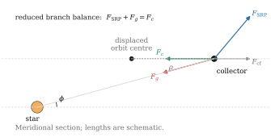
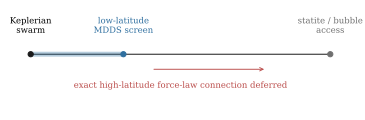
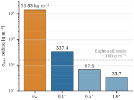
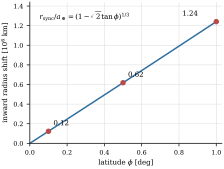

# Manuscript Draft

## Title

**From Keplerian Swarms to Radiatively Supported Bubbles: A Low-Beta Continuum Framework for Dyson Architectures**

## Abstract

Conventional Dyson swarms inherit a topology problem because same-shell Keplerian geometries concentrate encounter structure at shared nodal crossings, whereas fully radiatively supported statite or bubble concepts avoid that geometry only at severe areal-density cost. We therefore argue that Dyson architectures are better understood as a continuous support-and-stratification spectrum between those limits. Building on established solar-sail displaced non-Keplerian orbit (DNKO) theory and on a bridge that recent Dyson literature has already noted, we reinterpret the low-latitude displaced-orbit regime as an analytic architecture framework for layered Dyson-swarm design. In this Micro-Displaced Dyson Swarm (MDDS) framing, collectors remain primarily orbital while solar-radiation pressure maintains small out-of-plane displacements that create stratified latitude bands. For an ideal specular sail, this yields the closed-form support curve $\beta_{\min}(\phi)=\frac{3\sqrt{3}}{2}\sin\phi$ and equivalent areal-density limit $\sigma_{\max}(\phi)=\frac{2\sigma^*}{3\sqrt{3}\sin\phi}$.

This converts the architecture question into a simple screening criterion: a system is supportable at latitude $\phi$ if $\sigma_{\text{sys}} < \sigma_{\max}(\phi)$. The same framework yields a payload-optimized branch and a synchronization-constrained branch. We do not claim a complete Dyson-engineering realization, a new foundation for solar-sail orbit theory, or first discovery of the displaced-orbit bridge to swarm stratification; our narrower contribution is to elevate that bridge into a Dyson support continuum and analytic criterion for layered swarm design. Representative Sun-Earth examples at $\theta_\oplus$, $0.1^\circ$, $0.5^\circ$, and $1^\circ$ show a non-empty low-latitude window well below the full statite/bubble limit, although the allowable mass margin narrows rapidly with latitude. The result is a theory-grounded architectural framework that identifies an idealized low-latitude operating regime for further study.

## Figure Roadmap

- **Figure 1.** Keplerian deadlock and nodal-intersection geometry for conventional swarm configurations.
- **Figure 2.** Local force balance for a displaced HoverDisk element: sail thrust, stellar gravity, and the orbital centrifugal term, with the equivalent centripetal demand toward the offset-disk center.
- **Figure 3.** MDDS concept: low-latitude stratified rings above and below the ecliptic.
- **Figure 4.** Support continuum: the full $\beta_{\min}(\phi)$ and $\nu(\phi)$ spectrum from Keplerian limit to branch terminus, marking the $\beta=1$ architecture threshold and the $\nu=0$ branch endpoint.
- **Figure 5.** Latitude support curves $\beta_{\min}(\phi)$ and $\sigma_{\max}(\phi)$ in the low-latitude regime.
- **Figure 6.** Low-latitude illustrative window at $0.1^\circ$, $0.5^\circ$, and $1^\circ$.
- **Figure 7.** Earth-synchronous radius correction along the payload-optimized branch.

## 1. Introduction

### 1.1 Dyson swarms and the orbital topology-and-growth problem

Dyson structures remain one of the clearest thought experiments for stellar-scale energy harvesting, dating back to Dyson's proposal that an advanced civilization might reprocess a substantial fraction of stellar luminosity using distributed artificial collectors [Dyson, 1960]. Within the familiar shell/swarm/bubble taxonomy, the swarm is usually treated as the least structurally extreme option because it replaces a monolithic enclosure with a population of independent orbiting elements. That apparent simplification, however, leaves a different systems problem unresolved: how very large numbers of collectors can coexist at similar heliocentric radii without creating an increasingly pathological collision environment.

In a conventional Keplerian swarm, every orbital plane must pass through the central mass. Any two non-coplanar planes therefore intersect along a common nodal line. For circular or near-circular orbits occupying similar radial shells, that geometry generically creates path-crossing corridors at the nodes; for eccentric orbits, exact path intersection occurs when the nodal radii coincide. For sparse systems this may be tolerable. For dense systems, however, modern large-constellation collision and debris analyses make clear that collision risk and debris consequences become system-level management issues rather than isolated operational events (Radtke et al., 2017; Le May et al., 2018). Each added orbital plane then contributes not only more collecting area, but also additional crossing structure that must be phased, screened, and kept mutually separated.

One can try to mitigate this burden through phase-separated megaconstellation logic, Walker-like symmetry, or radial nesting. Such strategies may delay encounters or redistribute conjunction timing within a chosen design, but they do not geometrically remove the underlying crossing structure. In collector architectures, radial nesting or other dense multi-shell arrangements may also introduce optical crowding through mutual attenuation along shared star-centered sightlines, although we do not model that optical-packing tradeoff here (McInnes, 2026). Moreover, staged deployment and constellation reconfiguration are usually formulated for specific parameter sets and treated as explicit design problems rather than as frictionless indefinite growth (Walker, 1971; de Weck et al., 2004; Lee et al., 2018; Lee et al., 2025). We therefore use topology-and-growth problem in a deliberately limited architectural sense: a same-shell Keplerian buildout remains organized around shared nodal corridors, and expanding it generally requires renewed phasing and reconfiguration rather than simple geometric replication.

This is the Dyson-scale problem that motivates the paper. The aim is not merely to identify another solar-sail operating point, but to ask whether the usual Dyson taxonomy is itself too coarse. If collector populations can transition continuously from purely orbital support to partial radiative support and eventually to fully radiatively supported configurations, then shell/swarm/bubble categories are better understood not as isolated end states, but as regions within a larger support space. On that reading, the right theoretical object is not a single favored architecture, but a continuous design spectrum with identifiable working segments and engineering boundaries.

### 1.2 The prior-art bridge and the claim boundary

At the opposite extreme, radiatively supported concepts such as statites or Dyson bubbles eliminate the nodal-intersection problem by abandoning ordinary orbital support altogether. In that regime, radiation pressure must offset gravity directly, driving the system toward the critical areal-density threshold $\sigma^*$ and the corresponding $\beta \geq 1$ access condition for purely radiative-support designs. This endpoint is geometrically attractive but payload-hostile: even modest additions in structure, power, control, or instrumentation rapidly consume the available mass margin. The broader solar-sail literature already provides the immediate dynamical backdrop for this discussion, from early statite and halo-orbit treatments through families of displaced two-body orbits, displaced non-Keplerian orbit stability studies, and later Earth-/planet-synchronous variants (Forward, 1991; McInnes and Simmons, 1992a,b; McInnes, 1997, 1998; Quarta et al., 2020; Bassetto and Quarta, 2024).

The relevant prior-art landscape therefore has two mature branches. The first is the solar-sail and DNKO literature: statites, solar-sail halo orbits, families of displaced two-body orbits, displaced non-Keplerian orbit stability and control, and later synchronous heliocentric variants have all been studied extensively (Forward, 1991; McInnes and Simmons, 1992a,b; McInnes, 1997, 1998; McInnes, 1999; Quarta et al., 2020; Bassetto and Quarta, 2024). The second is the Dyson-swarm / Dyson-bubble literature, which frames stellar collector populations as large-scale engineering or observability problems rather than primarily as orbit-design problems (Dyson, 1960; Wright et al., 2015; McInnes, 2025, 2026).

Recent Dyson-focused work narrows the novelty boundary further. In a technosignature and swarm-dynamics discussion, McInnes (2026) explicitly notes that collisions in an orbiting Dyson swarm could in principle be minimized using displaced non-Keplerian orbits because the reflector planes can be stacked in parallel rather than left mutually inclined, and Appendix B traces the relevant geometry back to the Keplerian synchronous-mode family of McInnes and Simmons (1992). This is already very close to the core geometric move of the present paper: rewriting the problem from intersecting nodal planes to layered parallel families.

The open question, then, is no longer whether such an intermediate bridge exists in principle. Recent prior art already indicates that it does. The question is whether that bridge can be elevated from a compressed dynamical observation into a mathematically clean architecture framework with explicit screening variables, a growth-oriented design language, and a bounded low-latitude working window.

### 1.3 What this paper adds

The importance of that shift is not merely terminological. If Dyson architectures are treated only as discrete end-state categories, then the design problem becomes artificially polarized: one either accepts the intersection burden of a conventional Keplerian swarm, or jumps to payload-hostile radiative levitation. A continuum view changes the question. It asks how support, stratification, payload margin, and deployment logic vary as one moves continuously through support space. The relevant object of study is therefore not a single named megastructure, but a family of reachable architectures parameterized by how much of the support burden is carried orbitally and how much is carried radiatively.

This paper argues that the bridge signposted above can be developed into exactly such a framework. We consider Micro-Displaced Dyson Swarm (MDDS) configurations in which collectors remain primarily orbital while using a modest solar-radiation-pressure component to sustain small out-of-plane offsets. The objective is not full levitation. It is stratification: replacing one crowded orbital layer with multiple nearby latitude bands that no longer intersect.

Under this interpretation, MDDS is best viewed neither as a conventional Keplerian swarm nor as a near-bubble architecture. Instead, it is a low-$\beta$ intermediate regime within a broader support continuum. At $\phi = 0$, support is entirely orbital and the configuration reduces to the planar Keplerian limit. As $\phi$ increases, solar-radiation pressure progressively supplements orbital support. At still larger support fractions, one approaches the purely radiatively supported bubble/statite endpoint. The principal conceptual move of the paper is therefore to treat Dyson architectures not as a purely discrete shell/swarm/bubble taxonomy, but as a continuous support-and-stratification spectrum parameterized by quantities such as $\beta$, $\phi$, $\nu$, and $\sigma_{\max}(\phi)$.

The contribution of the paper is therefore primarily theoretical, but it operates at two linked scales. First, at the architectural scale, it proposes a continuum view of Dyson architectures and uses it to shift the system question from nodal-intersection management to layered support geometry. Second, at the idealized-physics scale, it rewrites the central design question as the intersection between a latitude support curve and a system areal-density budget. This yields a compact criterion for determining whether a collector architecture can be supported at a chosen off-plane latitude. The same framework naturally exposes a payload-optimized branch and a synchronization-constrained branch, with the latter treated as a recasting of known synchronous DNKO design space rather than as a new orbit-family claim.

### 1.4 Claim boundary and roadmap

For clarity, the present paper does not claim four things. First, it does not propose a fundamentally new orbit family or first articulate that displaced NKO families can relieve Dyson-swarm collision topology; it repurposes a known low-latitude DNKO branch into a Dyson-architecture language. Second, it does not prove full-lifecycle station-keeping, swarm-wide control closure, or long-horizon operational stability for a Dyson-scale population. Third, it does not establish economic optimality, deployment optimality, or system-level superiority over all Keplerian alternatives. Fourth, it does not provide a complete non-ideal optical model; the main support curve is derived under the ideal-specular approximation and should be read as a reference limit rather than a final engineering closure.

Our scope is intentionally limited. We do not attempt a full structural, thermal, control, or economic closure for a complete Dyson-scale system, nor do we attempt a formal megaconstellation-reconfiguration analysis. Instead, we use a small set of low-latitude representative cases to show that the framework is not empty, that it already admits an entry-level regime in the idealized Sun-Earth model, and that the working window narrows rapidly with latitude. The paper should therefore be read as a theory-grounded architectural framework with illustrative low-latitude slices, not as a claim that large-scale Dyson engineering, open-ended deployment economics, or the underlying displaced-orbit dynamics themselves have been solved anew here.

The paper proceeds in four moves. Section 2 develops the analytic support framework. Section 3 then draws out the architecture consequences of that framework before any illustrative numerics are asked to carry the main claim. Section 4 uses low-latitude slices only as supporting evidence that the framework is non-empty. Section 5 closes by marking the current modeling boundary and the most natural next extensions.

Figure 1 should be read as the motivating geometric picture for the paper, while Figures 2-7 then track the local force balance, the architectural translation into stratified rings, the support continuum, the quantitative support curves, and finally the low-latitude examples and synchronization variant.

*Figure 1. Keplerian deadlock and nodal-intersection geometry for conventional swarm configurations. All orbital planes passing through the central mass share mutual nodal lines; for same-radius circular or near-circular shells, those lines become crossing corridors that accumulate as swarm density increases.*

## 2. Analytic Support Framework

This section establishes the minimal analytic framework used throughout the rest of the paper. The objective is not to reproduce the full DNKO literature, but to isolate the specific quantities that make the Dyson-architecture problem screenable: the displacement latitude $\phi$, the lightness number $\beta$, the residual orbital contribution $\nu$, and the equivalent areal-density ceiling $\sigma_{\max}(\phi)$. Once these are written in one compact language, the later architecture discussion and low-latitude examples reduce to interpretation rather than repeated derivation.

### 2.1 Geometry, kinematics, and force balance

Consider a collector at fixed heliocentric distance $r$ and latitude $\phi$, moving in a circular path about the stellar rotation axis with angular velocity $\omega$. Let $\alpha$ denote the sail cone angle and define the orbital-rate ratio

$$
\nu \equiv \frac{\omega}{\sqrt{\mu/r^3}}.
$$

Writing the geometry in cylindrical coordinates gives

$$
\rho = r\cos\phi,\qquad z = r\sin\phi.
$$

For an ideal specular sail, the force-balance conditions become

$$
\beta \cos^3\alpha = \cos\phi(1-\nu^2),
$$

$$
\beta \cos^2\alpha\sin\alpha = \sin\phi.
$$

The first equation represents radial unloading of the effective gravitational demand; the second represents the out-of-plane support needed to maintain the displaced orbit.

Read mechanically, these equations simply restate the familiar displaced-orbit balance. Read architecturally, however, they do something more useful: they separate the support burden into an orbital contribution and a radiative contribution. That separation is what allows the present paper to talk about mixed-support Dyson architectures as points within a continuum rather than as members of disconnected conceptual categories.

*Figure 2. Local force balance for a displaced HoverDisk element in meridional section. In the co-rotating view, sail thrust, stellar gravity, and the orbital centrifugal term close as a three-vector balance; equivalently, in the inertial view, sail thrust plus gravity produce the centripetal demand toward the offset-disk center.*

Figure 3 is intended to visualize this displaced geometry at the architectural level, while Figures 4 and 5 capture the resulting support continuum and low-latitude support curves in compact form.

*Figure 3. MDDS concept: low-latitude stratified rings above and below the ecliptic. Collectors use modest radiation pressure to maintain small out-of-plane displacements, creating non-intersecting latitude bands.*

### 2.2 The payload-optimized branch

At fixed $\phi$, the most important engineering objective is usually to maximize the mass budget available to the system. Since $\beta = \sigma^*/\sigma$, this is equivalent to minimizing the required $\beta$. Solving that optimization over sail attitude yields

$$
\alpha_{\text{opt}} = \arctan\left(\frac{1}{\sqrt{2}}\right),
$$

and the low-$\beta$ support relation

$$
\beta_{\min}(\phi)=\frac{3\sqrt{3}}{2}\sin\phi.
$$

This is the central analytic result used throughout the paper. Within the broader and well-established DNKO framework, it functions here as the key specialization that makes the Dyson-swarm architecture question screenable in closed form. The underlying optimal-force geometry is not introduced here from scratch: the $35.264^\circ$ maximum out-of-plane-force pitch angle is already well established in the displaced-orbit and solar-sail trajectory literature (Simo and McInnes, 2010; Wawrzyniak and Howell, 2011). The specific role of the present paper is to recast that known optimal-angle result into the explicit support curve $\beta_{\min}(\phi)$ and then into the architecture criterion $\sigma_{\text{sys}} < \sigma_{\max}(\phi)$. The result shows that the displaced-orbit requirement grows linearly with latitude at small angles, but with a nontrivial prefactor that makes the exact requirement meaningfully stricter than naive heuristic estimates.

The same result can be rewritten as a limit on allowable system areal density:

$$
\sigma_{\max}(\phi)=\frac{\sigma^*}{\beta_{\min}(\phi)}
=\frac{2\sigma^*}{3\sqrt{3}\sin\phi}.
$$

The architecture question therefore reduces to a single criterion:

$$
\sigma_{\text{sys}} < \sigma_{\max}(\phi).
$$

Equivalently, within the ideal payload-optimized branch, a system of known areal density $\sigma_{\text{sys}}$ has a corresponding screening latitude limit

$$
\phi_{\max}=\arcsin\left(\frac{2\sigma^*}{3\sqrt{3}\,\sigma_{\text{sys}}}\right).
$$

provided the arcsin argument does not exceed unity. This inversion is only a screening relation for the ideal payload-optimized branch analyzed here, not a universal maximum-latitude bound for the full support continuum. One may either begin with a target latitude and ask what areal density is supportable there, or begin with a candidate system areal density and ask how far from the ecliptic it can be stratified on that branch. Outside that domain, the branch endpoint or alternative radiative-support families set the relevant limit rather than this inversion alone. In that sense the same closed-form relation serves both as a design equation and as a screening equation for the branch analyzed here.

### 2.3 Dyson support continuum

The support curve above is not only a local orbit result. In the present paper it is used to parameterize a broader Dyson support continuum. At one end lies the planar Keplerian swarm limit, where support is entirely orbital. At the other lies the purely radiatively supported bubble/statite endpoint, where orbital support vanishes. Between them lies a continuous family of mixed-support configurations, of which the low-$\beta$ branch analyzed here is a payload-tolerant segment.

This continuum is not meant to erase engineering differences between swarm-like and bubble-like systems. It is meant to supply a common parameterization for them. In the language of the present framework, the key coordinates along that support spectrum are the lightness number $\beta$, the latitude or off-plane angle $\phi$, the residual orbital contribution $\nu$, and the equivalent areal-density ceiling $\sigma_{\max}(\phi)$. Once written this way, the familiar Dyson categories become interpretable as distinct regions of one support space rather than as isolated conceptual islands.

It is useful to distinguish two different threshold notions within that continuum. The familiar $\beta = 1$ threshold remains an important architectural boundary: once a civilization can build collectors with $\beta \geq 1$, purely radiatively supported bubble/statite-like configurations enter the admissible design space. However, this is not the same as the internal endpoint of the low-$\beta$ payload-optimized MDDS branch derived here. Along that specific branch,

$$
\beta_{\min}(\phi)=1
\quad\Rightarrow\quad
\phi_{\beta=1}=\arcsin\left(\frac{2}{3\sqrt{3}}\right)\approx 22.638^\circ,
$$

at which point the branch still retains a nonzero orbital contribution,

$$
\nu^2 \approx 0.410,\qquad \nu \approx 0.640.
$$

So $\beta = 1$ does not mark the point where the present branch has become purely radiatively supported; it marks the point at which fully radiative-support architectures become available as an alternative design choice.

$$
\nu^2 = 1 - \sqrt{2}\tan\phi,
$$

so the orbital contribution vanishes only at

$$
\phi_c = \arctan\left(\frac{1}{\sqrt{2}}\right)\approx 35.264^\circ,
$$

for which

$$
\beta_{\min}(\phi_c)=1.5.
$$

Thus $\beta = 1$ should be read as the onset of the broader pure-radiative-support design space, whereas $\phi_c \approx 35.264^\circ$ and $\beta = 1.5$ mark the termination of the specific payload-optimized displaced-orbit branch analyzed in this paper. This distinction is important: $\phi_c$ is the internal endpoint of the present branch, not the terminal latitude of the full Dyson support continuum.

For clarity, these three markers can be summarized as follows:

| Marker | Condition | Angle / state | Physical meaning |
|--------|-----------|---------------|------------------|
| Planar Keplerian limit | $\phi = 0$ | $\beta = 0,\ \nu = 1$ | Pure orbital support; no off-plane displacement |
| Bubble/statite access threshold | $\beta = 1$ along the payload-optimized branch | $\phi \approx 22.638^\circ,\ \nu \approx 0.640$ | Pure radiative-support architectures become available as an alternative design choice, but the present branch still retains orbital support |
| Payload-optimized branch endpoint | $\nu = 0$ | $\phi_c \approx 35.264^\circ,\ \beta = 1.5$ | The present displaced-orbit branch itself reaches a purely radiative-support endpoint; this is not the endpoint of the full Dyson support continuum |

*Figure 4. Support continuum: the full spectrum from pure orbital support ($\phi=0$, $\nu=1$) to the payload-optimized branch terminus ($\phi \approx 35.3°$, $\nu=0$). The $\beta=1$ threshold at $\phi \approx 22.6°$ marks where bubble/statite architectures become viable alternatives, while the $\nu=0$ endpoint at $\phi \approx 35.3°$, $\beta=1.5$ marks where the present low-$\beta$ branch itself transitions to pure radiative support.*

*Figure 5. Latitude support curves in the low-latitude regime. Left: $\beta_{\min}(\phi)$ showing the required lightness number. Right: $\sigma_{\max}(\phi)$ showing the maximum allowable system areal density. Reference values at 0.1°, 0.5°, and 1° illustrate the rapid tightening of the feasibility window with increasing latitude.*

### 2.4 The synchronization-constrained branch

The same force-balance framework also admits a second natural design objective. Instead of minimizing $\beta$ at fixed $\phi$, one may impose an external timing requirement, such as Earth-synchronous heliocentric motion. In that case the angular velocity is fixed by the external period constraint, and the displaced orbit adjusts its radius accordingly. This branch is already recognizable within the DNKO literature and is included here as an operationally meaningful variant of the same architecture framework rather than as a new orbit family in its own right (Heiligers and McInnes, 2015; Quarta et al., 2020; Bassetto and Quarta, 2024).

For an Earth-synchronous condition with reference radius $a_\oplus$,

$$
r_{\text{sync}}(\phi,\alpha)=a_\oplus\left(1-\frac{\tan\phi}{\tan\alpha}\right)^{1/3}.
$$

On the payload-optimized branch this becomes

$$
r_{\text{sync}}(\phi)=a_\oplus\left(1-\sqrt{2}\tan\phi\right)^{1/3}.
$$

An important consequence follows immediately: the synchronization constraint modifies the orbital radius, but does not alter the fundamental support curve $\beta_{\min}(\phi)$ or the equivalent density limit $\sigma_{\max}(\phi)$. In other words, synchronization is primarily a geometric and operational constraint rather than an additional support penalty. Within the continuum view, it should therefore be read as a way of slicing the same support space under an additional temporal-organization requirement, not as a separate dynamical family.

That distinction matters for how the branch is interpreted later in the paper. The payload-optimized branch answers the question, ``What is the most mass-efficient way to support a chosen latitude?'' The synchronization-constrained branch answers a different question: ``What geometric adjustment is required if regular timing or common angular rate is imposed from outside?'' These are different cuts through the same support space, not competing definitions of the architecture itself.

### 2.5 Scope of the main-text analysis

The present analysis adopts the standard ideal-specular sail assumption, consistent with first-pass treatments of statite and Dyson-bubble critical areal density. This choice is deliberate. The aim of this paper is to establish the geometric and dynamical existence of a low-$\beta$ displaced operating regime in closed form. We note, however, that MDDS is more sensitive to non-ideal optical behavior than purely radial radiative-support concepts, because the displaced configuration depends on a specific decomposition of radiation pressure into radial and off-plane components. Non-ideal reflection, absorption, and thermal re-emission would therefore not only reduce the effective thrust magnitude, but also perturb the force direction and shift the practical support curve away from the ideal limit. This caveat is consistent with the higher-fidelity sail literature, which shows that realistic optical behavior and sail imperfections can attenuate characteristic acceleration and offset the effective force from the ideal sail normal (Dachwald et al., 2005; Wawrzyniak and Howell, 2011).

An equally important modeling boundary concerns the payload itself. In the force-balance derivation, the sail is treated as the sole optically active support surface. Payload elements such as photovoltaic panels are not assigned an explicit radiation-pressure contribution, nor are payload-induced attitude or offset-force effects carried into the closed-form balance equations. Their role in the present paper is purely inertial: they enter through the aggregate system areal density $\sigma_{\mathrm{sys}}$ in the later bookkeeping examples. The results derived here should thus be interpreted as an ideal baseline framework rather than a complete optical-realism or payload-coupled closure.

The framework above is the main theoretical contribution. Everything else in the paper is subordinate to it. The role of the later examples is not to complete the full engineering problem, but to show how the framework should be used and to demonstrate that it identifies a non-empty low-latitude operating window. Detailed structural closure, control-system design, long-duration perturbation analysis, and full deployment economics are therefore left outside the main claim of the present manuscript.

## 3. Architecture Reframing and Design Consequences

The main result of this paper is best understood as a reframing at two linked levels. At the architectural level, MDDS is not presented as a completed Dyson-engineering solution, but as an alternative language for organizing stellar collector populations: one that replaces intersecting same-radius swarm geometry with radiation-assisted latitude bands and thereby changes the native orbital-interaction geometry. At the idealized-physics level, the framework identifies a usefully screenable low-angle regime in which modest radiation-pressure support can produce large off-plane stratification without crossing into the payload-hostile bubble limit. This section unpacks why that reframing matters before the paper turns to illustrative slices.

### 3.1 Architecture Reframing

This reframing matters because it changes the central question. The relevant question is no longer whether a given displaced ring is intuitively plausible, but whether a system of areal density $\sigma_{\text{sys}}$ lies below the support curve $\sigma_{\max}(\phi)$. Once expressed in this form, the architecture becomes analyzable, comparable, and extensible. McInnes (2026) already points to the geometric bridge in compressed form. The main novelty of the present paper therefore lies not in introducing a fundamentally new family of solar-sail orbits, nor in first noticing that displaced NKO geometry can relieve Dyson-swarm crossings, but in reorganizing that bridge into an analytic architecture criterion for layered Dyson-swarm design and, beyond that, in using that criterion to define a continuous Dyson support spectrum.

This is also why the Dyson framing should be taken literally rather than decoratively. The continuum claim is not that shell, swarm, and bubble are engineeringly equivalent. It is that they can be parameterized within a common support logic while retaining sharply different cost, control, and payload consequences in different regions of that space. The specific contribution of MDDS is to take a region of that space that recent Dyson literature has only briefly signposted and make it explicit as a framework: a low-$\beta$ regime in which stellar collector populations remain mostly orbital, yet already acquire a qualitatively different topology from a conventional Keplerian swarm.

### 3.2 From End-State Taxonomy to Design Space

For Dyson theory, that shift is substantive. It replaces a discourse organized around static end states with one organized around traversable regions of design space. Once shell-like, swarm-like, and bubble-like constructs are interpreted as regions within a common support spectrum, questions of growth path, reachable intermediate regimes, and transition thresholds become first-class theoretical objects rather than afterthoughts. The role of MDDS in this paper is precisely to expose one such intermediate region in analytic form.

The same point can be stated in more explicitly architectural terms. In a same-radius Keplerian swarm, each additional non-coplanar orbit adds further nodal-crossing structure that must be phased and managed. Phase-separated constellation logic can redistribute the timing of those crossings, but it does not remove the crossing graph itself, and staged deployment or reconfiguration studies treat such changes as explicit design problems rather than as free extensions of a fixed symmetric pattern (Walker, 1971; de Weck et al., 2004; Lee et al., 2025). The present paper therefore does not claim a quantified reduction in conjunction-management or reconfiguration cost. Its narrower claim is that MDDS replaces same-shell nodal-crossing geometry with layered latitude bands in the idealized model, providing a different architectural baseline from which node-intersection count, minimum normal separation, conjunction-corridor density, and reconfiguration burden could later be measured.

### 3.3 Growth Path and Deployment Logic

MDDS instead shifts the organizing variable from the management of an expanding intersection network to the design of a layered support geometry. In the low-latitude regime, added capacity is expressed as additional latitude bands and, on the synchronization-constrained branch, as bands whose angular rates can be kept nearly common through modest radius adjustments. The immediate effect is not merely ``more space,'' but a change in the geometry of interactions: from repeated line-of-node crossings to separated layers with explicit normal spacing and operationally regular motion. That shift is the architectural significance of the low-$\beta$ regime.

The paper also suggests a useful deployment interpretation. Since the support curve is most permissive near the ecliptic, the framework naturally suggests a staged reading: low-latitude bands first, higher latitudes later as areal density improves. This should be read as a possible deployment logic rather than as a demonstrated optimal buildout strategy. The low-angle examples sharpen the point that even very small angular displacements already produce large geometric separations in the Sun-Earth environment. The present paper does not quantify deployment cost, swarm-management benefit, or reconfiguration avoidance using a formal traffic metric; it only identifies a geometry in which those questions can be posed without assuming the fixed same-shell crossing structure of the Keplerian case.

A natural next-step metric family would therefore include node-intersection count, minimum normal separation, conjunction-corridor density, and reconfiguration burden under staged expansion. The present paper stops one layer short of that formal traffic-and-growth analysis; its contribution is to identify a support geometry against which such metrics could later be evaluated.

### 3.4 Observational Implications of a Growth-First Continuum

The same staged-growth logic suggests a limited observational hypothesis. If a Dyson-scale collector population is more likely to emerge by first occupying the low-latitude, low-$\beta$ part of the support continuum and only later expanding toward higher latitudes, then its developing morphology need not resemble a nearly isotropic shell. Over a substantial interval of its buildout history, it may instead appear as a flattened and stratified circumstellar structure.

In that restricted geometric sense, a developing MDDS-like system could be observationally closer to an organized circumstellar disk than to the canonical shell-like image of a Dyson sphere. The present paper does not attempt radiative-transfer modeling, spectral prediction, or discriminants against natural disks, so this point should be read only as a framework-generated hypothesis rather than as an observational claim already demonstrated.

## 4. Low-Latitude Illustrative Slices

The role of this section is deliberately limited. It does not attempt a full engineering closure, and it is not intended to bear the paper's main novelty claim. Its purpose is narrower and more practical: to show that the continuum established in Section 2 contains a real low-$\beta$ operating window, to attach representative scales to that window, and to illustrate how the analytic criterion behaves when confronted with lightweight spacecraft-style areal-density bookkeeping.

### 4.1 Representative latitudes

To keep the paper aligned with its central contribution, the main-text examples are intentionally narrow. They are not the paper's primary novelty claim. Their role is to demonstrate that the continuum identified above contains a non-empty low-$\beta$ segment with physically meaningful separation scales. We therefore use four representative points: the Earth-angular-radius characteristic angle $\phi = \theta_\oplus \approx 0.00244^\circ$, followed by $\phi = 0.1^\circ$, $\phi = 0.5^\circ$, and $\phi = 1^\circ$. The sharper contraction by $\phi = 2^\circ$ is retained only as an outer comparison point.

Using $\sigma^* \approx 1.53\ \mathrm{g\,m^{-2}}$, the support curve gives:

$$
\beta_{\min}(\theta_\oplus)\approx 1.11\times 10^{-4},\qquad \sigma_{\max}(\theta_\oplus)\approx 13.83\ \mathrm{kg\,m^{-2}},
$$

$$
\beta_{\min}(0.1^\circ)\approx 0.00453,\qquad \sigma_{\max}(0.1^\circ)\approx 337.4\ \mathrm{g\,m^{-2}},
$$

$$
\beta_{\min}(0.5^\circ)\approx 0.0227,\qquad \sigma_{\max}(0.5^\circ)\approx 67.5\ \mathrm{g\,m^{-2}},
$$

$$
\beta_{\min}(1.0^\circ)\approx 0.0453,\qquad \sigma_{\max}(1.0^\circ)\approx 33.8\ \mathrm{g\,m^{-2}},
$$

These values are sufficient for the limited purpose of the section: to show that the low-latitude window is real, but tightens rapidly, approximately as $1/\phi$ in the small-angle limit. In particular, the $\theta_\oplus$ point shows that the continuum already has a near-entry regime at the scale of one Earth radius of normal displacement at 1 AU.

Taken together, these points form a deliberately uneven staircase of difficulty. The $\theta_\oplus$ case marks the near-entry edge of the continuum; $0.1^\circ$ shows a regime that is already geometrically large yet still mass-per-area permissive; $0.5^\circ$ and $1^\circ$ then illustrate how quickly the mass budget begins to tighten once one asks for more ambitious stratification. The value of the set is therefore comparative rather than exhaustive.

Figure 6 should be read as the main-text illustrative window for the low-angle regime, anchored by the explicit representative points listed above.

*Figure 6. Low-latitude feasibility window showing maximum supportable areal density $\sigma_{\max}$ at representative latitudes. Even the entry-level $0.1^\circ$ case already produces substantial geometric separation while remaining far more permissive in areal-density terms than the better-known high-latitude or bubble limits.*

### 4.2 Entry-level interpretation

Even very small latitudes correspond to very large geometric separations at 1 AU. At $\phi = 0.1^\circ$, the out-of-plane displacement is already about $2.61\times 10^5$ km. Comparing to $\theta_\oplus$, a $0.1^\circ$ MDDS displacement corresponds to about $41$ Earth radii of off-plane separation, while $0.5^\circ$ and $1^\circ$ correspond to about $205$ and $410$ Earth radii respectively. The point of MDDS is not to achieve dramatic angular offsets; it is to obtain enormous spatial stratification from modest angular displacements while staying well below the full radiative-support threshold.

This Earth-angle comparison also suggests a natural entry-level characteristic angle for the framework itself. At $\phi = \theta_\oplus$, the support threshold $\sigma_{\max}(\theta_\oplus)\approx 13.83\ \mathrm{kg\,m^{-2}}$ is already well within the broad range of present human spacecraft materials and systems. Geometrically, it corresponds to an out-of-plane separation of approximately one Earth radius, $z \approx 6{,}371\ \mathrm{km}$. If one additionally imposes Earth-synchronous motion on the payload-optimized branch, the corresponding inward radius correction is only about $3.0\times 10^3\ \mathrm{km}$. The significance of this point is not that it solves the full MDDS engineering problem, but that it shows the continuum has a genuinely near-entry regime rather than only a distant futuristic one.

This is the sense in which MDDS differs from both comparison endpoints. Relative to a Keplerian swarm, it sacrifices some mass and energy margin in exchange for non-intersecting stratification. Relative to a statite or bubble concept, it remains far from the $\beta \geq 1$ regime and therefore preserves a much larger payload budget.

### 4.3 Order-of-magnitude engineering slices

The low-latitude framework becomes more concrete when coupled to a minimal areal-density bookkeeping exercise. Consider an illustrative decoupled node composed of an ultralight reflector and a photovoltaic payload with fill factor $\lambda = A_{\mathrm{pv}}/A_{\mathrm{refl}}$. To first order,

$$
\sigma_{\mathrm{sys}} = \sigma_{\mathrm{refl}} + \lambda \sigma_{\mathrm{pv}},
$$

with all second-order structural and control terms deliberately left outside the main-text estimate. In keeping with the modeling scope of this paper, the photovoltaic payload is treated here as added areal density rather than as a second optically resolved surface. That is, its own radiation pressure, thermal re-emission, and possible force-vector offsets are ignored in the main-text bookkeeping. Using a light reflector benchmark of $\sigma_{\mathrm{refl}} \approx 5\ \mathrm{g\,m^{-2}}$ and an ultralight PV benchmark of $\sigma_{\mathrm{pv}} \approx 54.8\ \mathrm{g\,m^{-2}}$, the support curve immediately implies approximate low-latitude fill-factor limits:

- at $0.1^\circ$, the ideal areal-density budget no longer constrains $\lambda$ below unity
- at $0.5^\circ$, the same is still true to first order
- at $1^\circ$, the bookkeeping gives $\lambda_{\max} \approx 0.53$

These numbers are useful because they convert an abstract support curve into a design-language statement. Instead of asking only whether a latitude is mathematically supportable, one can ask how much photovoltaic fill or payload fraction survives once a reflector benchmark is specified. That translation from support relation to payload fraction is one of the simplest ways to make the continuum operationally legible.

These values should not be read as a final engineering design. Their purpose is narrower: they show how the support curve translates directly into a shrinking payload fraction as latitude rises, even before one introduces heavier structural realism. In particular, the $0.1^\circ$ point is useful because $\sigma_{\max} \approx 337\ \mathrm{g\,m^{-2}}$ is no longer an obviously exotic areal-density threshold. In pure mass-per-area terms, this entry-level low-latitude regime approaches a domain that contemporary lightweight spacecraft can plausibly inhabit. That observation should not, however, be extrapolated indiscriminately across the full $0.1^\circ$--$1^\circ$ interval: $0.5^\circ$ and especially $1^\circ$ already demand materially lighter systems than those demonstrated by current flown sailcraft, so the present manuscript treats them as screening slices rather than near-term engineering claims (Macdonald and McInnes, 2011; Mansell et al., 2023).

That interpretation becomes sharper if one compares directly against flown or near-flight sailcraft. LightSail 2 combined a roughly $5\ \mathrm{kg}$ CubeSat-class spacecraft with a deployed sail area of $32\ \mathrm{m^2}$, corresponding to a mission-level loading of about $156\ \mathrm{g\,m^{-2}}$ (Mansell et al., 2023). NEA Scout, at less than $14\ \mathrm{kg}$ and about $86\ \mathrm{m^2}$ of sail area, falls in a similar range, roughly $160\ \mathrm{g\,m^{-2}}$ (Johnson et al., 2017). These benchmarks sit far below the $\theta_\oplus$ and $0.1^\circ$ support thresholds, but well above $\sigma_{\max}(1^\circ)$. This is precisely why the current paper frames the low-angle window as non-empty yet rapidly narrowing: the extreme entry regime already overlaps current lightweight sailcraft capability in mass-per-area terms, while the more ambitious low-degree regime remains significantly ahead of present integrated system practice.

### 4.4 Synchronization slice

The synchronization-constrained branch is also easy to interpret numerically in the low-latitude regime. On the payload-optimized branch, the Earth-synchronous radius correction is small but non-negligible:

- at $0.1^\circ$, $r_{\mathrm{sync}} \approx 0.99918\ \mathrm{AU}$, corresponding to an inward shift of about $0.12$ million km
- at $0.5^\circ$, $r_{\mathrm{sync}} \approx 0.99587\ \mathrm{AU}$, corresponding to an inward shift of about $0.62$ million km
- at $1^\circ$, $r_{\mathrm{sync}} \approx 0.99170\ \mathrm{AU}$, corresponding to an inward shift of about $1.24$ million km

This is useful for interpretation because it reinforces the distinction between the two design branches. The support requirement is still controlled by $\beta_{\min}(\phi)$ and $\sigma_{\max}(\phi)$; synchronization mainly alters where the ring sits, not whether the latitude is supportable in the first place.

Figure 7 should therefore be read not as a second feasibility boundary, but as an operational-geometry correction layered on top of the same support framework.

*Figure 7. Earth-synchronous radius correction along the payload-optimized branch. The inward shift from 1 AU grows with latitude but does not alter the fundamental support curve—synchronization is an operational geometry constraint, not an additional support penalty.*

### 4.5 What the low-latitude slices show

The low-latitude slices establish one thing and one thing only: the continuum identified in Section 2 contains a real and potentially useful low-$\beta$ segment. They do not by themselves establish full system competitiveness, lifetime, control closure, or economic superiority. Their purpose is to verify that the architecture framework maps onto a physically meaningful region rather than collapsing immediately into either the Keplerian limit or the full statite limit. For contrast, the same support curve yields only $\sigma_{\max}(2^\circ)\approx 16.9\ \mathrm{g\,m^{-2}}$, showing how quickly the margin contracts once one moves beyond the entry-level low-latitude regime.

That is exactly the level of inference the present paper needs. The examples do not prove that MDDS is already an engineering solution, but they do prove that the continuum is not empty rhetoric. There exists a mathematically coherent, physically interpretable, and quantitatively nontrivial low-angle regime in which large geometric stratification appears before the architecture reaches the fully radiative-support limit.

## 5. Boundaries and Next Steps

### 5.1 Modeling Boundaries

At the same time, the ideal-mirror assumption should be interpreted carefully. For purely radial radiative-support concepts, optical non-idealities primarily act as thrust-efficiency penalties. For MDDS, by contrast, non-ideal optical behavior can also perturb the effective force direction because the displaced configuration relies on a specific vector decomposition of radiation pressure. This does not invalidate the present framework, but it does mean that the closed-form support curve derived here is best understood as an ideal reference limit that later optical-realism studies should correct upward rather than replace wholesale.

An equally important reviewer concern is long-term maintainability. The broader DNKO literature has already shown that displaced orbits can include marginally stable or unstable subfamilies under open-loop dynamics, and that linear state feedback can be used to stabilize such configurations in practice (McInnes, 1998; Bookless, 2006). The present paper does not attempt to re-derive a distributed control law for a Dyson-scale population, but neither does it assume that stability is a solved freebie. The correct reading is narrower: the architecture framework established here addresses geometric existence and screening-level supportability, while long-horizon station-keeping, phase control, and swarm-wide feedback design belong to the next layer of analysis. Existing DNKO control results make that next layer plausible enough that its omission does not undermine the framework claim, but they do not remove the need for future explicit treatment.

### 5.2 Scope and Next Steps

The present manuscript also stops short of the heavier engineering questions. Detailed structural closure, fixed bus mass, deployment mechanics, perturbation-control closure, thermal closure, and broader power-system comparisons remain important follow-on problems. That boundary is intentional. The paper is not trying to compress the entire Dyson-engineering stack into a first framework manuscript; it is trying to establish the lowest layer on which the larger engineering stack can be coherently posed.

The appropriate claim at this stage is therefore limited but substantive: the framework is mathematically coherent, physically interpretable, and non-empty in the low-latitude regime. If later work adds optical realism, explicit control closure, deployment economics, and traffic-style growth metrics, those additions would extend the present framework rather than replace its central architectural claim.

## 6. Conclusion

We have introduced a low-$\beta$ framework for Micro-Displaced Dyson Swarm architectures and derived a closed-form support relation linking off-plane latitude to required radiation-pressure support. This yields a simple density-based criterion and exposes two natural design directions: a payload-optimized branch and a synchronization-constrained branch. Relative to current prior art, the contribution is not the first identification of displaced non-Keplerian plane-stacking as a way to mitigate Dyson-swarm crossings; recent Dyson literature already notes that bridge. The contribution is instead threefold: at the architectural level, the paper advances a continuous Dyson support-spectrum view in which swarm-like and bubble-like configurations occupy different regions of a common support space; within that spectrum, MDDS emerges as a low-$\beta$ alternative to the conventional Keplerian Dyson swarm by recasting known displaced-orbit dynamics into a layered Dyson-swarm design language; and at the idealized-physics level, the Sun-Earth environment already contains a non-empty low-angle operating window in which modest angular displacement produces large spatial separation while entry-level characteristic angles provide useful scale comparisons against present lightweight spacecraft systems.

The architectural significance of that result is not only that a low-$\beta$ displaced-orbit regime can be identified in the idealized model. It is that this regime changes the organizing question. Instead of treating Dyson growth purely as a problem of managing ever-richer intersection networks in fixed-parameter Keplerian megaconstellations, it allows the problem to be restated in terms of layered support geometry, synchronization choices, and staged latitude expansion. The main contribution is therefore not a new solar-sail orbit family or a proof of full engineering viability, but a compact analytic framework for discussing stratified Dyson-swarm architectures and a low-latitude regime that warrants further study under more realistic optical, control, and system assumptions.

The immediate next step is not to abandon this idealized framework, but to stack additional realism on top of it in an orderly way. The most natural extensions are improved optical-force models, explicit station-keeping and feedback analysis for multi-node populations, traffic-style measures of topology reduction under staged growth, heavier system-level bookkeeping for deployment and payload closure, and observational modeling for whether a developing low-latitude Dyson architecture would present more like an artificial circumstellar disk than a shell-like technosignature. Those extensions would test the engineering reach of MDDS, but they would do so on top of the support-spectrum language established here. In that sense, the present paper is best read as a first architectural control surface: a compact framework that makes the next generation of Dyson-swarm questions more sharply poseable.

## References

The canonical bibliography for the manuscript is maintained in [bibliography.bib](/Users/kehao95/Projects/personal/dysonSphere/Paper/references/bibliography.bib).
